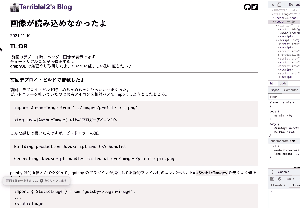

### アイコンが画面いっぱいに広がって…

 先日記事のデプロイが完了して本番環境で確認したところ、ページ描画直後に一瞬 Twitter, GitHub のアイコンが巨大化 → 戻る、という状態になっていた。



```
// styled-componentsで下記のように指定されている。
const OtherAccountIcon = styled.img`
  border-radius: 8px;
  height: 28px;
  width: 28px;
`;
```

width・height は一応指定してるので、たぶんスタイルが適用されないやつかな？

### 修正

スタイルが適用されるのが一瞬遅れる〜みたいな不具合は以前に何度か経験していたが、とりあえず症状でググる。

ありがたいことにいくつかの日本語記事がヒット。  
https://blog.mono0x.net/2020/06/16/react-fontawesome/  
https://blog.uhy.ooo/entry/2020-05-10/gatsby-fontawesome-ssg/  
[これらの記事で言及されているイシュー](https://github.com/FortAwesome/react-fontawesome/issues/134)によれば、

> デフォルト値 true の`autoAddCss`オプションが指定されている場合、動的に CSS を読みこむようになっている。  
> SSR で HTML を描画する場合、このオプション指定による CSS 読み込みは HTML 描画よりも遅れる。

らしい。その解決方法として、

> アイコンが描画される直前に CSS がロードされる。  
> `autoAddCss` が false になるよう明示的に書くことで、font-awesome が CSS に動的に追加されるのを防ぐ。

とのことでした。

```
// Layout.tsxに追記
import { config } from "@fortawesome/fontawesome-svg-core";

config.autoAddCss = false;
```

この修正するついでに、font-awesome の SVG 画像を src/images 下に置いておく方式から npm install していく方法に変更しました。  
前回書いてた graphQL こねまわすやり方はあまりにもあまりだと思っていたので、今回ついでに直せてよかったです

```
import { FontAwesomeIcon } from '@fortawesome/react-fontawesome';
import { faGithub, faTwitter } from '@fortawesome/free-brands-svg-icons';
...
// アイコン2つにいちいち属性書くのは…いやだ！という気持ち
const IconProps = {
  color: 'black',
  width: 28,
  height: 28
};
<FontAwesomeIcon icon={faGithub} {...IconProps} />
```

### 次回以降やりたいこと

本当は今日はフッターまわりを変えたいな〜と思っていたんですが、上記の修正に普通に 1 時間ちょいかかったので次回にまわします。  
あとはコメント機能とかもブログにはデフォルトでついていてほしいので、おいおい実装したいですね
